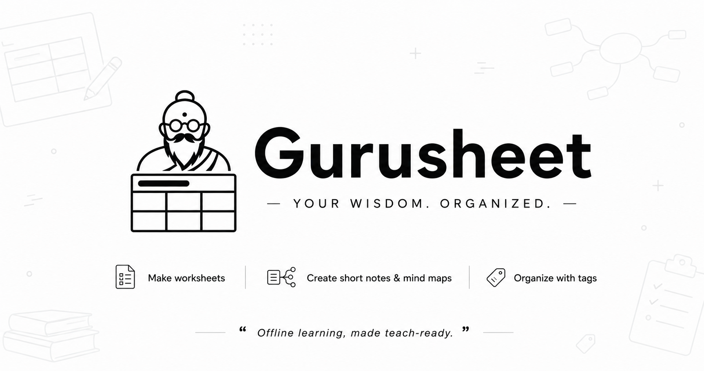

# GuruSheet



**Track:** Intelligence with Purpose  
**Team:** GuruSheet

---

## Problem

Teachers often need several classroom-ready versions of the same material, but making worksheets, revision notes, and mind maps by hand takes too long. This is especially difficult in mixed-ability classrooms, where every learner needs a different level of support. GuruSheet reduces that preparation burden while keeping the teacher in control of the source material and final output.


---

## Solution

GuruSheet is an offline-first teacher workspace that turns textbook PDFs and NCERT ZIP files into usable learning material. A teacher imports a book, selects a chapter, and uses chat to create differentiated worksheets, short notes, or mind maps grounded in that chapter's text. They can refine questions, choose difficulty and question types, organise work with coloured tags, and export a clean PDF ready for the classroom.

---

## Run Locally

You need Node.js 18.18+ and one model provider: OpenRouter, a Gemini-compatible endpoint, or local Ollama.

```bash
git clone https://github.com/realhardik18/guru-sheet.git
cd guru-sheet/client
npm install
cp .env.example .env.local
```

Edit `.env.local` to select a provider and add its API key. For fully local inference, set `AI_PROVIDER=ollama` and run an Ollama-compatible model on your machine.

```bash
npm run smoke  # checks the configured model and structured output
npm run dev
```

Open [http://localhost:3000](http://localhost:3000), then complete the one-time setup to choose where GuruSheet should store books and generated content.

---

## How Gemma Is Used

- **Model variant:** Gemma 4 26B A4B Instruct (`google/gemma-4-26b-a4b-it`)
- **How it's used:** Structured generation plus chat assistance, served through OpenRouter by default; the app can also use a Gemini-compatible endpoint or a local Ollama model.
- **Why this Gemma variant:** It supports the structured outputs needed to reliably produce schema-validated worksheets instead of loose text. The default OpenRouter model is also available on a free tier for accessible prototyping.
- **Any customization:** No fine-tuning. GuruSheet uses task-specific system prompts and Zod schemas for worksheet, notes, and mind-map outputs. Chapter text is supplied as grounded context, and the model is instructed not to invent facts outside it. A local model fallback path is available through Ollama configuration.

---

## Architecture

The Next.js frontend lets teachers import content, select chapters, chat, and preview printable artifacts. The backend extracts text and chapter boundaries from PDFs, stores everything in a teacher-selected local folder, and sends only the relevant chapter text to Gemma for generation. Structured outputs are validated before they are rendered as a worksheet, note sheet, or printable mind map.

```text
Teacher
  │
  ├── Import PDF / NCERT ZIP ──> PDF indexer ──> Local chapter text + metadata
  │
  └── Chat request ──> Next.js API ──> Gemma ──> Validated structured artifact
                                                    │
                                                    └── Print / Export PDF
```

**Tech stack:** TypeScript, Next.js, React, Tailwind CSS, Vercel AI SDK, Zod, PDF.js/unpdf, OpenRouter, Gemini-compatible API, and optional Ollama for local inference.

---

## Results / Demo

- Creates differentiated, print-ready worksheets from a selected textbook chapter.
- Produces short notes and compact, PDF-safe mind maps with short labels that do not overlap.
- Supports per-question revisions, colour-coded quick tags, and local persistence for books, chats, and generated content.
- Keeps the teacher workflow local-first: source books and saved work stay in a chosen local folder.
- **Demo video:** [Watch on YouTube](https://www.youtube.com/watch?v=TtCIw0jmSJY)

---

## Links

- **GitHub repo:** [github.com/realhardik18/guru-sheet](https://github.com/realhardik18/guru-sheet)
- **Dataset(s) used:** Teacher-provided textbook PDFs and NCERT ZIP archives; users must ensure they have permission to use their source materials.
- **Demo:** [Watch on YouTube](https://www.youtube.com/watch?v=TtCIw0jmSJY)
- **License for this project:** [MIT](LICENSE)

---

## Acknowledgments

- Google Gemma and the OpenRouter ecosystem for model access.
- NCERT and teachers whose textbook materials inform the classroom workflow.
- The open-source projects behind Next.js, React, the Vercel AI SDK, Zod, and PDF.js.
